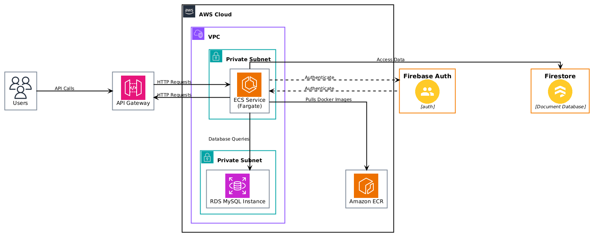
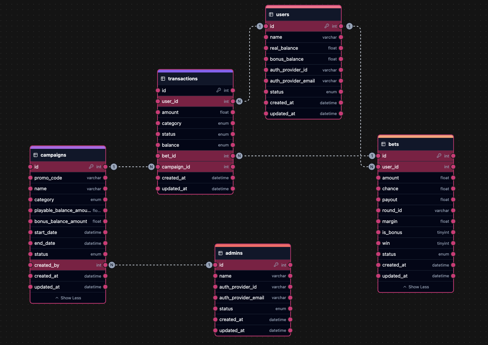

# Backend Technical Test Project

  

## Introduction

  

This project is a NestJS API that implements a GraphQL endpoint. It serves as a solution for the technical test for Senior Backend Engineer position on Ancient Gaming. The application provides functionalities related to user authentication, campaign management, betting system, transactions, and admin functionalities.

  

## Features

-  **User Authentication** : Registration, login, password reset for users.

-  **Admin Authentication** : Registration, login, password reset for admins.

-  **Campaign Management** : Create and manage promotional campaigns.

-  **Betting System** : Users can place bets with real or bonus balances.

-  **Transactions** : Record transactions related to bets, campaigns, and user balances.

-  **Firebase Integration** : Authentication and password management via Firebase.

-  **AWS SSM Parameter Store Integration** : Configuration management using AWS SSM.

-  **Role-Based Access Control** : Guards and decorators to protect routes based on user roles.


## Architecture Diagram

### Infrastructure



### Database



## Deployed Endpoint

The project deployed version is available at: `https://ji2xdv6110.execute-api.us-east-1.amazonaws.com/graphql`.

## LOCAL VERSION

### Prerequisites

-  **Node.js** : Ensure you have Node.js installed (v14 or higher recommended).

-  **npm** : Comes with Node.js.

-  **AWS Account** : For SSM Parameter Store.

-  **Firebase Account** : For Firebase Authentication.

-  **MySQL** : Database for storing application data.

  

### Steps

1.  **Clone the Repository**

  

```bash

git  clone <repository-url>

cd <repository-directory>

```

2.  **Install Dependencies**

  

```bash

npm  install

```

3.  **Set Up Environment Variables** Create a `.env` file in the root directory and add the necessary environment variables.

  

```dotenv

# Database
DB_USERNAME=
DB_PASSWORD=
DB_DATABASE=
DB_HOST=
DB_PORT=


```

**Note** : Some configuration values are fetched from AWS SSM. Ensure the AWS credentials have access to SSM Parameter Store.

4.  **Run Database Migrations**

If you have migrations set up, run them to create the necessary tables.

  
  

```bash

# Example using Sequelize CLI

npx  sequelize  db:migrate

```

  

## Configuration

The application uses AWS SSM Parameter Store to fetch configuration values at runtime. The `SSMConfigService` handles caching and refreshing of these values.

**Parameters Used:**

-  `/ag-backend-test/auth/authSecret`: JWT secret key.

-  `/ag-backend-test/app/betMargin`: Default bet margin value.

-  `/ag-backend-test/firebase/firebaseCredentials`: Firebase Project credentials

-  `/ag-backend-test/firebase/firebaseApiKey`: Firebase API KEY
  
- Other database and Firebase configurations can also be stored in SSM.

**Firebase Configuration:**

-  **FIREBASE_API_KEY** : Your Firebase project's API key.

-  **FIREBASE_CREDENTIALS** : Base64-encoded Firebase service account JSON.

  

## Running the Application

  

### Development Mode

  
  

```bash

npm  run  start:dev

```

  

This command starts the application in watch mode, automatically reloading on code changes.

  

### Production Mode

  
  

```bash

npm  run  build

npm  run  start:prod

```

  

### Accessing the Application

By default, the application runs on `http://localhost:3000`.

### GraphQL Playground

You can access the GraphQL Playground at `http://localhost:3000/graphql`.

## API Documentation

  

### User Operations

-  **Register User**

  

```graphql

mutation {

registerUser(input: {

name: "John Doe",

authProviderEmail: "john@example.com",

password: "securepassword",

promoCode: "WELCOME"

}) {

id

name

authProviderEmail

}

}

```

-  **Login User**

  

```graphql

mutation {

loginUser(input: {

authProviderEmail: "john@example.com",

password: "securepassword"

}) {

token

user {

id

name

}

}

}

```

-  **Reset User Password**

  

```graphql

query {

resetUserPassword(email: "john@example.com") {

resetLink

}

}

```

-  **Claim Campaign**

  

```graphql

mutation {

userClaimCampaign(input: {

promoCode: "WELCOME",

category: REGISTER

}) {

claimed

campaign {

id

name

}

}

}

```

  

### Admin Operations

-  **Register Admin**

  

```graphql

mutation {

registerAdmin(input: {

name: "Admin User",

authProviderEmail: "admin@example.com",

password: "adminpassword"

}) {

id

name

authProviderEmail

}

}

```

-  **Login Admin**

  

```graphql

mutation {

loginAdmin(input: {

authProviderEmail: "admin@example.com",

password: "adminpassword"

}) {

token

admin {

id

name

}

}

}

```

-  **Reset Admin Password**

  

```graphql

query {

resetAdminPassword(email: "admin@example.com") {

resetLink

}

}

```

-  **Create Campaign**

  

```graphql

mutation {

createCampaign(input: {

name: "Welcome Bonus",

promoCode: "WELCOME",

startDate: "2023-01-01T00:00:00Z",

endDate: "2023-12-31T23:59:59Z",

playableBalanceAmount: 100.0,

bonusBalanceAmount: 50.0,

category: REGISTER,

status: ACTIVE

}) {

id

name

promoCode

}

}

```

  

### Betting Operations

-  **Create Bet**

  

```graphql

mutation {

createBet(input: {

amount: 10.0,

chance: 0.5,

roundId: "round123",

isBonus: false,

simulateSettlement: true

}) {

id

amount

payout

win

}

}

```

-  **Get Best Bet Per User**

  

```graphql

query {

getBestBetPerUser(limit: 10) {

id

userId

amount

payout

}

}

```

### Authentication and Authorization 

Most of the application's endpoints are protected and require authentication. To interact with these endpoints, you need to:
 
1. **Login** : Use the login mutation to authenticate as a user or admin, depending on the endpoint you wish to access.

**Example for User Login:** 

```graphql
mutation {
  loginUser(input: {
    authProviderEmail: "john@example.com",
    password: "securepassword"
  }) {
    token
    user {
      id
      name
    }
  }
}
```
 
2. **Retrieve Token** : Upon successful login, you'll receive a JWT token in the response.
 
3. **Set Authorization Header** : For subsequent requests to protected endpoints, include the token in the `Authorization` header using the `Bearer` schema.

**Example Header:** 

```makefile
Authorization: Bearer <your-jwt-token>
```
**Note** : Without including the valid JWT token in the `Authorization` header, you will receive an `Unauthorized` or `Forbidden` error when accessing protected endpoints.

  
### Betting Process 

#### 1. Placing a Bet 

Users can place a bet by providing the following input:
 
- **Amount** : The amount to bet.
 
- **Chance** : The probability of winning (e.g., 0.5 for a 50% chance).
 
- **Round ID** : An identifier for the betting round.
 
- **Is Bonus** : A boolean indicating whether to use the bonus balance.
 
- **Simulate Settlement** : A boolean to determine if the bet should be settled immediately.
**Mutation Example:** 

```graphql
mutation {
  createBet(input: {
    amount: 10.0,
    chance: 0.5,
    roundId: "round123",
    isBonus: false,
    simulateSettlement: true
  }) {
    id
    amount
    payout
    win
    status
  }
}
```

#### 2. Bet Validation 

Before a bet is placed, several validations occur:
 
- **User Verification** : Ensures the user exists and is not blocked.
 
- **Balance Check** : Confirms the user has sufficient funds in the selected balance (real or bonus).
 
- **Input Validation** : Validates the chance value and other inputs.

#### 3. Bet Creation 
 
- A new bet record is created with the status set to `OPEN` or `SETTLED` based on the `simulateSettlement` flag.

- The user's balance is debited by the bet amount.

- A transaction record is created to reflect the debit.

#### 4. Bet Settlement 

If `simulateSettlement` is `true`, the bet is settled immediately: 

- **Win Determination** : The outcome is randomly determined based on the `chance` value. 
  - A random number is generated, and if it's less than the `chance`, the bet is a win.
 
- **Payout Calculation** : 

  - **Formula** : `Payout = Amount * (1 / Chance) * Margin`
 
  - **Margin** : A value fetched from AWS SSM Parameter Store (default is 0.05 or 5%).
 
  - **Bonus Balance Bets** : If using bonus balance, only the net profit is credited to the real balance.
 
- **Balance Update** : The user's real balance is credited with the payout.
 
- **Transaction Records** : Additional transaction records are created for winnings.

#### 5. Margin Application 

The margin reduces the potential payout to give the house an edge.
 
- **Fetch Margin** : Retrieved from AWS SSM using `SSMConfigService`.
 
- **Default Value** : If not set, defaults to 0.05 (5%).

#### 6. Transaction Management 

All financial movements are recorded:
 
- **Bet Transaction** : Records the amount debited from the user's balance.
 
- **Win Transaction** : If the user wins, records the amount credited to the user's real balance.
  


